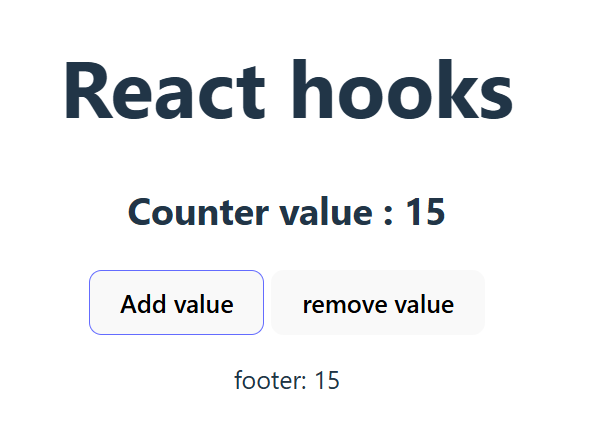

# 🧮 React Counter App

A simple counter application built using **React** and **useState** hook.  
This project demonstrates updating state in React, including multiple state updates in a single function call.

---

## 📸 Screenshot

<p align="center">
  
</p>

---

## 📂 Project Structure
```
react-counter/
├── public/
│   ├── index.html
│   └── favicon.ico
├── src/
│   ├── App.css
│   ├── App.jsx
│   ├── main.jsx
│   └── index.css
├── package.json
└── README.md
```

---

## 🚀 Features
- Increment counter by **+4** with a single button click.
- Decrement counter by **-1**.
- Demonstrates functional updates in `useState`.
- Simple and beginner-friendly React code.

---

## 🛠️ Installation & Setup

1. **Clone the repository**
   ```bash
   git clone https://github.com/anuj-singal/react-practice.git
   ```

2. **Navigate to the project folder**
   ```bash
   cd react-practice
   ```

3. **Install dependencies**
   ```bash
   npm install
   ```

4. **Run the app**
   ```bash
   npm run dev
   ```

5. Open your browser at:
   ```
   http://localhost:5173
   ```

---

## 📝 Code Explanation

### `useState` Hook
We start the counter at `15`:
```javascript
const [counter, setCounter] = useState(15);
```

### Increment Function
Using functional updates ensures that each increment is based on the latest state value:
```javascript
const addValue = () => {
  setCounter(prev => prev + 1);
  setCounter(prev => prev + 1);
  setCounter(prev => prev + 1);
  setCounter(prev => prev + 1);
};
```

### Decrement Function
A simple decrement by `-1`:
```javascript
const removeValue = () => {
  setCounter(counter - 1);
};
```

---

## 📜 License
This project is licensed under the **MIT License**.  
You are free to use, modify, and distribute this project.

---

## 👨‍💻 Author
<p>
  <a href="https://github.com/anuj-singal">
    
  </a>
</p>
